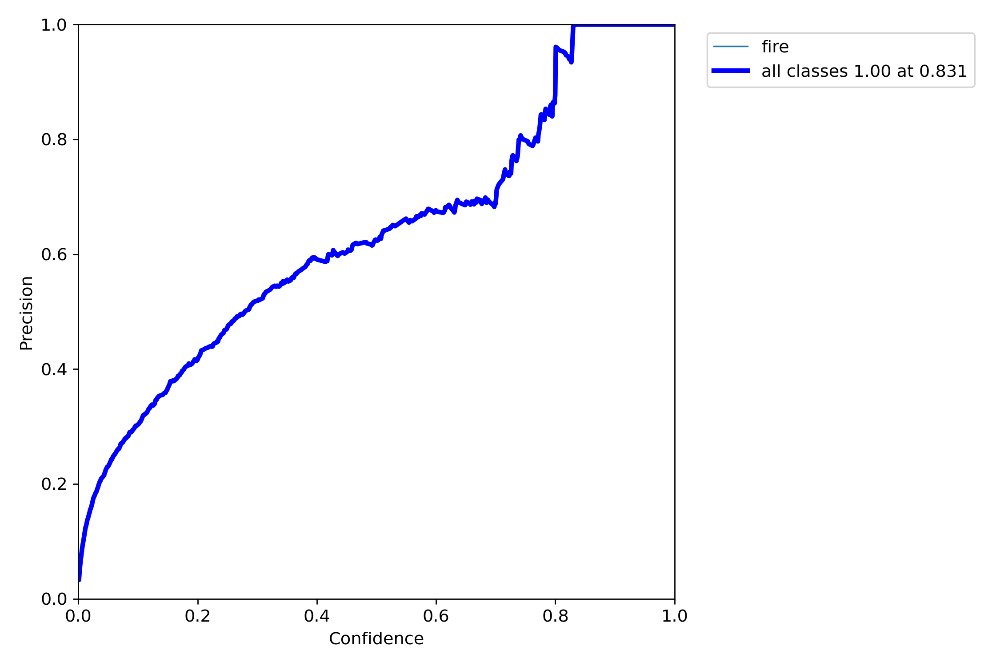
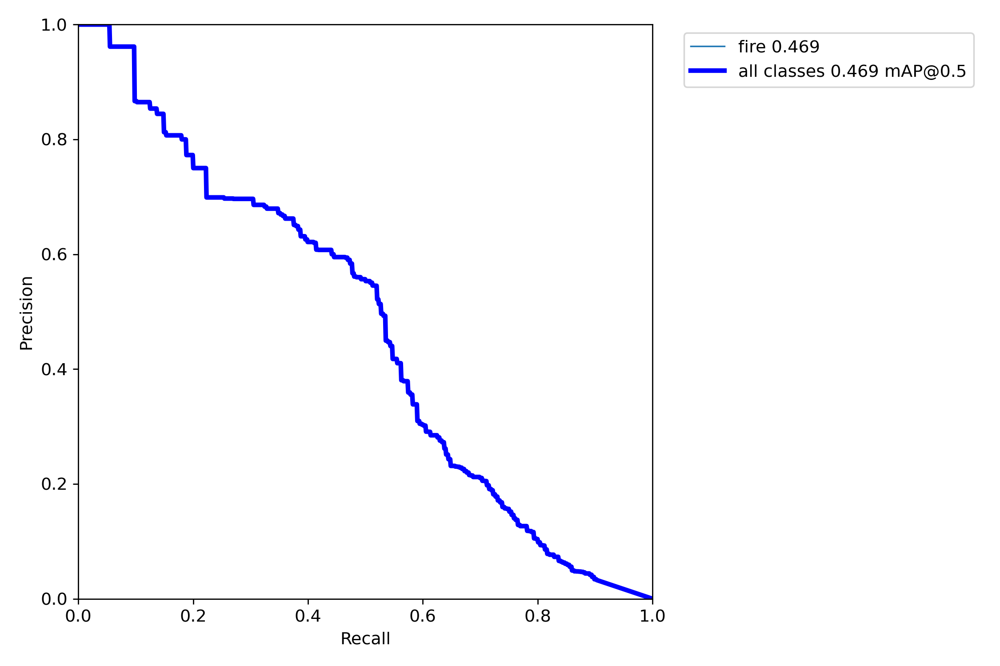
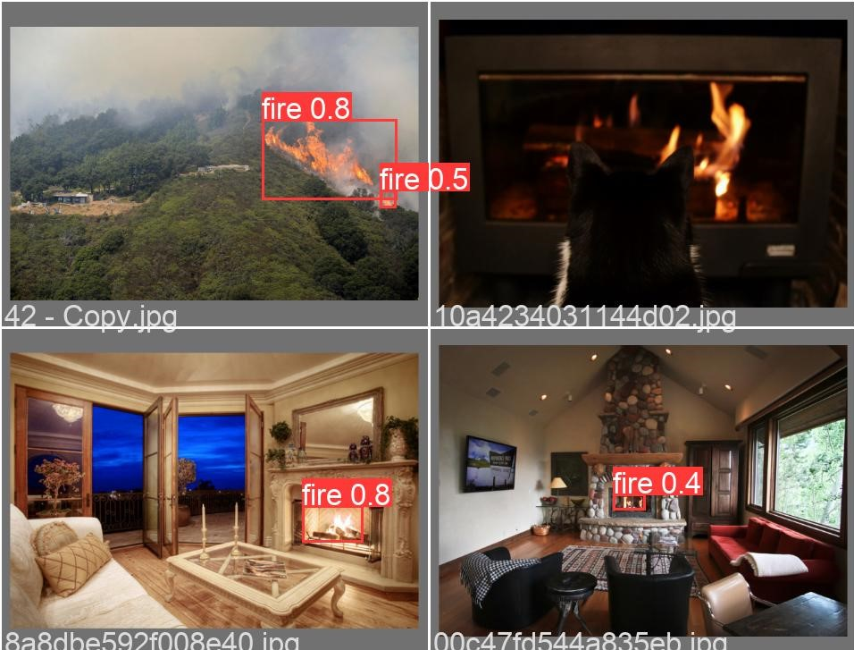

#D-dataset
#https://github.com/gaiasd/DFireDataset?tab=readme-ov-file

### Compilation for changes made by Sudarsun for HazardMon project.
```
cd ioopt
source scripts/setvars.sh
cd appbench/apps/yolov5-fire-detection
./compile.sh
./install_cuda.sh #only if you have and are running on GPU and installing CUDA
sudo reboot  #only if you have and are running on GPU and installing CUDA
```

### Download the dataset
You can download the dataset and unzip it
```
cd datasets
Download from  https://drive.google.com/file/d/1TQKA9nzo0BVwtmojmSusDt5j02KWzIu9/view?usp=sharing
unzip -d ZIPFILENAME //You will see train and val folder
```

### Make the dataset larger to stress the system. Note this is only for the first time you are installing the application.
```
cd yolov5-fire-detection //Navigate to the yolov5-fire-detection folder
cp -r datasets/fire/train/images datasets/fire/train/images-orig
cp -r datasets/fire/train/labels datasets/fire/train/labels-orig
python copyimage.py 3 //Scale the factor by 3 times
```


### Running the training steps 
```
./train-run-med.sh
```

<h1 align="center"><span>YOLOv5 for Fire Detection</span></h1>

Fire detection task aims to identify fire or flame in a video and put a bounding box around it. This repo includes a demo on how to build a fire detector using YOLOv5. 

<p align="center">
  
</p>

## 🛠️ Installation
Clone this repo and use the following script to install [YOLOv5](https://github.com/ultralytics/yolov5). 
```
# Clone
git clone https://github.com/spacewalk01/Yolov5-Fire-Detection
cd Yolov5-Fire-Detection

# Install yolov5
git clone https://github.com/ultralytics/yolov5  
cd yolov5
pip install -r requirements.txt
```


## 🏋️ Training
I set up ```train.ipynb``` script for training the model from scratch. To train the model, download [Fire-Dataset](https://drive.google.com/file/d/1TQKA9nzo0BVwtmojmSusDt5j02KWzIu9/view?usp=sharing) and put it in ```datasets``` folder. This dataset contains samples from both [Fire & Smoke](https://www.kaggle.com/dataclusterlabs/fire-and-smoke-dataset) and [Fire & Guns](https://www.kaggle.com/atulyakumar98/fire-and-gun-dataset) datasets on Kaggle. I filtered out images and annotations that contain smokes & guns as well as images with low resolution, and then changed fire annotation's label in annotation files.
```
python train.py --img 640 --batch 16 --epochs 10 --data ../fire_config.yaml --weights yolov5s.pt --workers 0
```

## 🌱 Inference
If you train your own model, use the following command for detection:
```
python detect.py --source ../input.mp4 --weights runs/train/exp/weights/best.pt --conf 0.2
```
Or you can use the pretrained model located in ```models``` folder for detection as follows:
```
python detect.py --source ../input.mp4 --weights ../models/best.pt --conf 0.2
```

## ⏱️ Results
The following charts were produced after training YOLOv5s with input size 640x640 on the fire dataset for 10 epochs.

| P Curve | PR Curve | R Curve |
| :-: | :-: | :-: |
|  |  |  |

#### Prediction Results
The fire detection results were fairly good even though the model was trained only for a few epochs. However, I observed that the trained model tends to predict red emergency light on top of police car as fire. It might be due to the fact that the training dataset contains only a few hundreds of negative samples. We may fix such problem and further improve the performance of the model by adding images with non-labeled fire objects as negative samples. The [authors](https://github.com/ultralytics/yolov5/wiki/Tips-for-Best-Training-Results) who created YOLOv5 recommend using about 0-10% background images to help reduce false positives. 

| Ground Truth | Prediction | 
| :-: | :-: |
|  |  |
|  |  | 

#### Feature Visualization
It is desirable for AI engineers to know what happens under the hood of object detection models. Visualizing features in deep learning models can help us a little bit understand how they make predictions. In YOLOv5, we can visualize features using ```--visualize``` argument as follows:

```
python detect.py --weights runs/train/exp/weights/best.pt --img 640 --conf 0.2 --source ../datasets/fire/val/images/0.jpg --visualize
```

| Input | Feature Maps | 
| :-: | :-: |
|  |  |

## 🔗 Reference
I borrowed and modified [YOLOv5-Custom-Training.ipynb](https://github.com/ultralytics/yolov5/wiki/Train-Custom-Data) script for training YOLOv5 model on the fire dataset. For more information on training YOLOv5, please refer to its homepage.
* https://github.com/robmarkcole/fire-detection-from-images
* https://github.com/ultralytics/yolov5
* https://github.com/AlexeyAB/darknet
